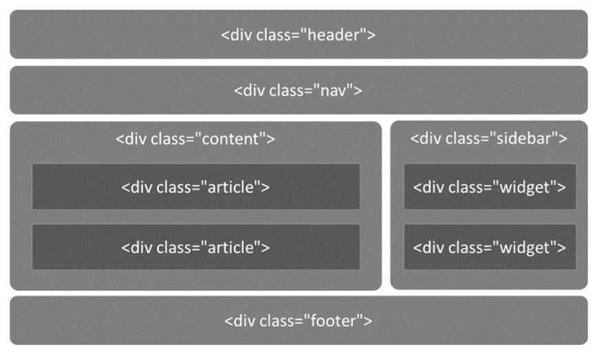
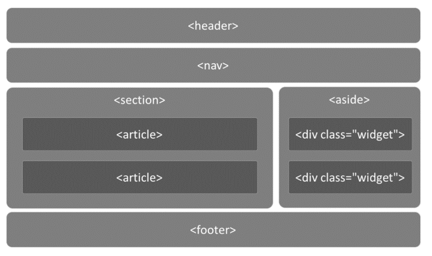

## Html样式和语义

`<style>="定义文档的样式信息"`
--

`<div>="定义文档中的节片段"`
--

`<span>="定义文本的一部分，或文档的一部分"`
--

`<header>="定义文档或小节的页眉"`
--

`<hgroup>="定义标题和相关内容"`
--

`<footer>="定义文档或小节的页脚"`
--

`<main>="定义文档的主要内容"`
--

`<section>="定义文档中的一个部分"`
--

`<search>="定义搜索部分"`
--

`<article>="定义文章 独立的内容"`
--

`<aside>="定义页面内容之外的内容 应与周围的内容间接相关"`
--

`<details>="定义可查看或隐藏的详细信息"`
--
`1、open="展开详细信息 默认不可见"`

`<summary>="定义 <details> 元素的可见标题`
--

```html
    <details>
        <summary>标题</summary>
        <p>详细信息</p>
    </details>
```

`<dialog>="定义对话框或窗口"`
--
- `1. open="规定 dialog 元素处于活动状态，并且用户可以与之交互`

`<data>="添加给定内容的机器可读的翻译"`
--
- `1. value="规定元素内容的机器可读翻译"`

## Buju





## css
```css
style {
    display: none;
}

div {
    display: block;
}

header {
    display: block;
}

hgroup {
    display: block;
}

footer {
    display: block;
}

section {
    display: block;
}

search {
    display: block;
}

article {
    display: block;
}

aside {
    display: block;
}

details {
    display: block;
}

summary {
    display: block;
}
```
