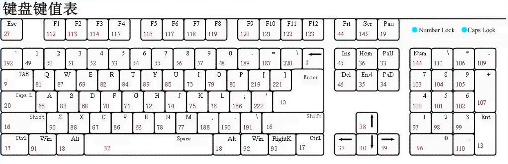
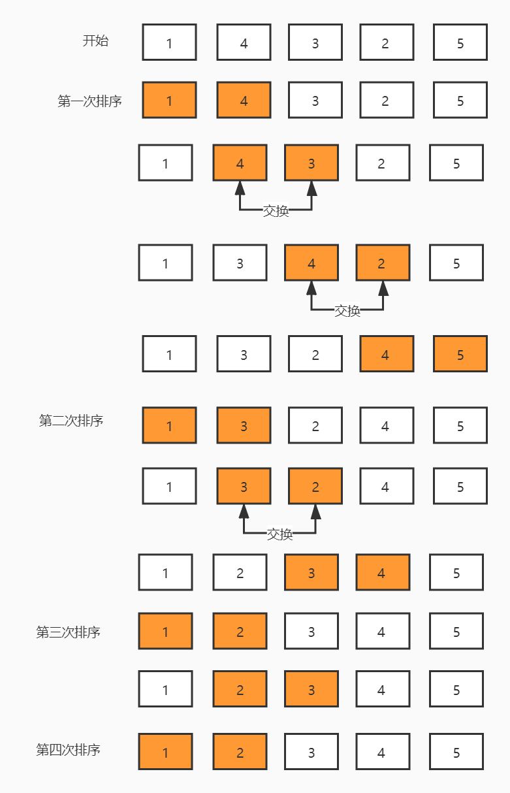
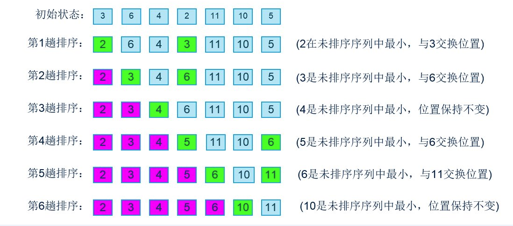

## 001-Basic

`JavaScript 组成部分：BOM DOM ECMAScript`
--
`1、BOM - Browser Object Model：JS 操作浏览器发生变化的属性和方法`

`2、DOM - Document Object Model：JS 操作文档流发生变化的属性和方法`

`3、ECMAScript ：JS 的书写语法和书写规则`

`JavaScript 书写位置：行内式 内嵌式 外链式`
--
`1、行内式 - 直接把代码书写在标签身上`

`2、内嵌式 - 把代码书写在一个 script 标签对内`

`3、外链式 - 把代码书写在一个 .js 文件内`

`定义变量`
--
`1、关键字 var`

`打印语句`
--
`alert()` `console.log()` `document.write()`

`数据类型`
--
`1、基本数据类型: 数值 字符串 布尔 空: Undefined没有值 Null有值值为空`

`2、引用数据类型`

`基本数据类型检测`
--
`var reselt = typeof data`

`数据类型转换`
--
`1、转数值` `Number()` `parseInt()` `parseFloat()` `NaN: 非数值`

`2、转字符串` `String()` `.toString()`

`3、转布尔` `.Boolean()` `false 值: 0 NaN '' Undefined Null`

`运算符`
--
`1、算数运算符` `布尔类型可以运算`

`2、赋值运算符`

`3、比较运算符` `== 值相同为真` `=== 值和数据类型相同为真`

`4、逻辑运算符`

`5、自增自减运算符`

`条件分支语句IF`
--
`1、if(){...}`

`2、if(){...}else(){...}`

`3、if(){...}else if(){...}`

`4、if(){...}else if(){...}else{...}`

`条件分支语句Switch`
--
```js
switch(已知条件){
    case 选项1:
    ...
    break
    case 选项2:
    ...
    break
}default{
    ...
}
```

`循环语句while`
--
```js
定义初始变量
while(条件){
    ...
    改变初始值
}
```

`循环语句dowhile`
--
```js
定义初始变量
do{
    ...
    改变初始值
} while(条件)
```

`循环语句for`
--
```js
for(定义初始变量；条件判断；改变初始值){
    ...
}
```

`函数`
--
`1、函数定义`

```js
function fn(形式参数) {
    ...
    return
} 
```

`2、函数调用`

```js
fn(实际参数)
```

`作用域`
--
`1、全局作用域`

`2、私有作用域`

`3、定义 声明在什么位置的变量是哪一个作用域的变量`

`4、访问 自己有用自己的 自己没有用父级的以此类推 到全局都没有就报错`

`5、赋值 自己给自己的赋值 自己没有给父级的赋值以此类推 到全局都没有 定义为全局再赋值`

`对象数据类型`
--
```js
var obj{
    k:v,
    k:v,
} 
```

`1、增` `obj.k = v` `obj['k'] = v`

`2、删` `delete obj.k` `delete obj['k']`

`3、改`

`4、查`

`数组数据类型 默认值 undefined`
--
`1、var arr = [number,string,boolean]`

`2、获取长度` `arr.length`

`3、索引` `arr[i]`

`4、设置` `arr[i] = value`

`5、遍历`


`数组属性`
--
`1、arrobj.length="设置或返回数组中元素的长度"`

`2、obj.constructor="返回对创建此对象的数组函数的引用"`

```js
var obj = new Array();
if (obj.constructor==Array){
    document.write("This is an Array");
}
if (obj.constructor==Boolean){
    document.write("This is a Boolean");
}
if (obj.constructor==Date){
    document.write("This is a Date");
}
if (obj.constructor==String){
    document.write("This is a String");
}
```

```js
function obj(name,job,born){
    this.name=name;
    this.job=job;
    this.born=born;
}
var obj = new obj("1","1",1);
document.write(obj.constructor);

<!--输出: 
    function obj(name,job,born) { this.name=name; this.job=job; this.born=born; }
    -->
```

`3、obj.prototype="向对象添加属性和方法"`

```js
function obj(name,job,born){
    this.name=name;
    this.job=job;
    this.born=born;
}
var obj = new obj("1","1",1);
obj.prototype.age=20;
document.write(obj.age);
```

`4、index`

`5、input`

`数组方法`
--
`改变原始数组`
--
`1、push="向数组的末尾添加元素"`

- `1. 必需 添加到数组的第元素 可以是任意多个`

- `1. 返回新的长度`

`2、pop="删除数组的最后一个元素"`

- 

- `1. 返回原数组的最后一个元素`

`3、unshift="向数组的开头添加一个或更多元素 返回新的长度"`

- `1. 必需 添加到数组的第元素 可以是任意多个`

- `1. 返回新的长度`

`4、shift="删除数组的第一个元素"`

- 

- `返回原数组的第一个元素`

`5、reverse="反转数组元素顺序"`

`6、splice="截取元素向数组添加新元素"`

- `1. 必须 index 整数规定添加删除项目的位置使用负数可从数组结尾处规定位置`

  `2. 必须 删除的项目数量 设置为 0 则不会删除`

  `3. 可选 向数组添加的新项目`

- `1. 被删除项目的新数组`

`7、sort="数组元素排序"`

- `1. 可选 规定排序顺序必须是函数` `没有使用参数将按字母顺序对数组中的元素进行排序说得更精确点是按照字符编码的顺序进行排序要实现这一点首先应把数组的元素都转换成字符串以便进行比较` `如果想按照其他标准进行排序就需要提供比较函数 该函数要比较两个值然后返回一个用于说明这两个值的相对顺序的数字 比较函数应该具有两个参数 a b` `若 a<b 则返回一个小于 0 的值 在排序后的数组中 a 应该出现在 b 之前 若 a=b 则返回 0 若 a>b 则返回一个大于 0 的值` `返回 a-b 升序 b-a 降序 -1 反转 0 不变 1 反转`

    ```js
    <!--字母
        G,J,T,J,A,M
        A,G,J,J,M,T
        -->
    ```

    ```js
    <!--数字
        10,5,40,25,1000,1
        1,10,1000,25,40,5
        -->
    ```

    ```js
    function sort(a,b){
        return a - b
    }
    var arr = new Array(6)
    arr[0] = "10"
    arr[1] = "5"
    arr[2] = "40"
    arr[3] = "25"
    arr[4] = "1000"
    arr[5] = "1"
    document.write(arr + "<br/>")
    document.write(arr.sort(sort))

    <!--输出
        10,5,40,25,1000,1
        1,5,10,25,40,1000
        -->
    ```

- `1. 返回对数组的引用 注意数组在原数组上进行排序不生成副本`

`不改变原始数组`
--
`1、join="数组元素连接为字符串"`

- `1. 可选 指定要使用的分隔符 如果省略该参数 则使用逗号作为分隔符`

- `1. 返回一个字符串 该字符串是通过把原数组的每个元素转换为字符串然后把这些字符串连接起来 在两个元素之间插入分隔符字符串而生成的`

`2、concat="拼接数组"`

- `1. 必须 参数可以是具体的值 也可以是数组对象 可以是任意多个`

- `1. 返回一个新的数组 该数组是通过把所有参数添加到原数组中生成的新数组 如果操作的参数是数组那么添加的是数组中的元素而不是数组`

`3、slice="截取数组"`

- `1. 必需 start 规定从何处开始选取 如果是负数那么规定从数组尾部开始算`

  `2. 可选 end 规定从何处结束选取 参数是数组片断结束处的数组下标 如果没有指定则从 start 到数组结束的所有元素 如果参数是负数那么规定的是从数组尾部开始算起的元素`

- `返回一个新的数组 包含从 start 到 end (前闭后开 不包括该元素) 的原数组中的元素`

`4、indexOf="查找数据在数组中的索引"`

`5、valueOf="返回数组对象的原始值"`

`6、forEach="遍历数组"`

`7、map="映射数组"`

`8、filter="过滤数组"`

`9、every="判断数组元素是否全部满足条件"`

`10、some="判断数组元素是否有满足条件"`

`11、toSource="返回该对象的源代码"`

- `只有 Gecko 核心的浏览器如 Firefox 支持该方法 IE Safari Chrome Opera 等浏览器均不支持该方法`

    ```js
    function obj(name,job,born){
        this.name=name;
        this.job=job;
        this.born=born;
    }
    var obj=new obj("1","1",1);
    document.write(obj.toSource());

    <!--输出
        ({name:"1", job:"1", born:1})
        -->
    ```

`12、toString="把数组转换为字符串 并返回结果"`

`13、toLocaleString="把数组转换为本地数组 并返回结果"`

`字符串数据类型`
--

`字符串属性`
--
`1、strobj.length="字符串的长度"`

`2、obj.constructor="对创建该对象的函数的引用"`

`3、obj.prototype="允许您向对象添加属性和方法"`

`字符串方法`
--
`不改变原始字符串`

`1、charAt="返回在指定位置的字符"`

- `1. 必须 index 表示字符串中某个位置的数字即字符在字符串中的下标`

`2、toLowerCase="把字符串转换为小写"`

`3、toUpperCase="把字符串转换为大写"`

`4、replace="替换字符串"`

- `1. 必须 规定子字符串 或 要替换的模式的 RegExp 对象即正则对象` `如果该值是一个字符串则将它作为要检索的直接量文本模式` `如果 RegExp 具有全局标志 g 那么将替换所有匹配的子串 否则只替换第一个匹配子串`

  `2. 必须 可以是字符串 也可以是函数` `如果它是字符串，那么每个匹配都将由字符串替换 $ 字符具有特定的含义` `$1、$2、...、$99 与 RegExp 中的第 1 到第 99 个子表达式相匹配的文本` `$& 与 RegExp 相匹配的子串` `$'(反引号) 位于匹配子串左侧的文本 ` `$' 位于匹配子串右侧的文本 ` `$$ 直接量符号` `函数的第一个参数是匹配模式的字符串 第二个参数是与模式中的子表达式匹配的字串可以有 0 个或多个这样的参数 第三个参数是一个整数声明了匹配在原字符串中出现的位置 第四个参数是原字符串`

  ```js
  普通替换 str.replace(/ABC/, "DEF")
  全局替换 str.replace(/ABC/G, "DEF")
  ```

- `1. 新的字符串`

`5、trim="去除首尾空格"`

`6、split="把字符串分割为字符串数组"`

- `1. 必须 字符串或正则表达式 从该参数指定的地方分割原字符串`

  `2. 可选 该参数可指定返回的数组的最大长度如果设置了该参数返回的子串不会多于这个参数指定的数组如果没有设置该参数整个字符串都会被分割不考虑它的长度`

- `1. 返回字符串数组`

`7、substr="从起始索引号提取字符串中指定数目的字符"`

- `1. 必须 start 起始下标必须是数值如果是负数那么该参数声明从字符串的尾部开始算起的位置`

  `2. 可选 length 返回子串中的字符数 如果省略返回从原字符串的开始位置到结尾的字串`

- `1. 返回新的字符串`

`8、substring="提取字符串中两个指定的索引号之间的字符"`

- `1. 必须 start 一个非负的整数`

  `2. 可选 stop 一个非负的整数 如果省略该参数那么返回的子串会一直到字符串的结尾`

- `1. 返回新的字符串 如果 start 比 stop 大那么该方法在提取子串之前会先交换这两个参数`

`9、slice="提取字符串的片断并在新的字符串中返回被提取的部分"`

- `1. 必需 start 规定从何处开始选取 如果是负数那么规定从字符串尾部开始算`

  `2. 可选 end 抽取结尾的下标 若未指定此参数 则要提取的子串包括 start 到原字符串结尾的字符串 如果该参数是负数那么它规定的是从字符串的尾部开始算起的位置`
- `1. 返回新的字符串 包含从 start 到 end (前闭后开 不包括该元素) 的所有字符`

`数学对象`
--

`数学属性`
--
`1、Math.E="返回算术常量 e，即自然对数的底数(约等于 2.718)"`

`2、Math.LN2="返回 2 的自然对数(约等于 0.693)"`

`3、Math.LN10="返回 10 的自然对数(约等于 2.302)"`

`4、Math.LOG2E="返回以 2 为底的 e 的对数(约等于 1.414)"`

`5、Math.LOG10E="返回以 10 为底的 e 的对数(约等于 0.434)"`

`6、Math.PI="返回圆周率(约等于 3.14159)"`

`7、Math.SQRT1_2="返回返回 2 的平方根的倒数(约等于 0.707)"`

`8、Math.SQRT2="返回 2 的平方根(约等于 1.414)"`

`数学方法`
--
`1、random="返回 0 ~ 1 之间的随机数 前闭后开"`

`2、round="四舍五入取整"`

`3、ceil="向上取整"`

`4、floor="向下取整"`

`5、pow="取幂"`

- `1. 底数`

  `2. 幂数`

- `1. 如果结果是虚数或负数 则该方法将返回 NaN 如果由于指数过大而引起浮点溢出则该方法将返回 Infinity`

`6、sqrt="平方根"`

`7、abs="绝对值"`

`8、max="最高值"`

- 

- `1. 返回最大的值 如果没有参数则返回 -Infinity 如果有某个参数为 NaN则返回 NaN`

`9、min="最低值"`

- 

- `1. 返回最小的值 如果没有参数则返回 Infinity 如果有某个参数为 NaN则返回 NaN`


`时间对象`
--
`1、var date=new Date()`

`2、var time = new Date(2021, 2, 31, 9, 40, 25)`

`时间属性`
--
`1、constructor="返回对创建此对象的 Date 函数的引用"`

`2、prototype="使您有能力向对象添加属性和方法"`

`时间方法`
--
`获取`

`1、getFullYear="获取时间对象中的 年份 信息"`

`2、getMonth="获取时间对象中的 月份 信息"`

`3、getDate="获取时间对象中的 日期 信息"`

`4、getHours="获取时间对象中的 小时 信息"`

`5、getMinutes="获取时间对象中的 分钟 信息"`

`6、getSeconds="获取时间对象中的 秒钟 信息"`

`7、getDay="获取时间对象中的 星期 信息"`

`8、getTime="获取时间对象中的 时间戳 信息 返回 1970 年 1 月 1 日至今的毫秒数 格林威治时间"`

`设置`

`1、setFullYear="设置时间对象中的 年份 信息"`

`2、setMonth="设置时间对象中的 月份 信息"`

`3、setDate="设置时间对象中的 日期 信息"`

`4、setHours="设置时间对象中的 小时 信息"`

`5、setMinutes="设置时间对象中的 分钟 信息"`

`6、setSeconds="设置时间对象中的 秒钟 信息"`

`7、setTime="设置时间对象中的 时间戳 信息"`

`正则 RegExp 对象`
--
`1、/RegExp/修饰符`

`2、var regExp =new RegExp(String or RegExp,修饰符);`

`正则 RegExp 属性`
--
`1、regExp.global="RegExp 对象是否具有标志 g"`

`2、regExp.ignoreCase="RegExp 对象是否具有标志 i"`

`3、regExp.multiline="RegExp 对象是否具有标志 m"`

`4、regExp.lastIndex="一个整数 标示开始下一次匹配的字符位置"`

`5、regExp.source="正则表达式的源文本"`

```js
var str = "RegExp Global";
var regExp = new RegExp("Reg");
if(regExp.global){
    alert("Global property is set");
}else{
    alert("Global property is NOT set");
}
```

`正则 RegExp 方法`
--
`1、compile="脚本执行过程中编译正则表达式 于改变和重新编译正则表达式"`

- `1. 正则表达式`

  `2. 规定匹配的类型 "g" "i" "gi"`

`2、exec="检索字符串中指定的值 返回找到的值并确定其位置"`

- `1. 必须 string 要检索的字符串`

- `2. 返回一个数组 其中存放匹配的结果 如果未找到匹配则返回值为 null`

`3、test="检索字符串中指定的值 返回 true 或 false"`

- `1. 必须 string 要检索的字符串`

- `2. 如果字符串 string 中含有与 RegExpObject 匹配的文本则返回 true`

`正则 RegExp 修饰符`
--
`1、i="执行对大小写不敏感的匹配"`

`2、g="执行全局匹配 查找所有匹配而非在找到第一个匹配后停止"`

`3、m="执行多行匹配"`

`正则 RegExp 方括号` `方括号用于查找某个范围内的字符`
--
`1、[abc]="查找方括号之间的任何字符"`

`2、[^abc]="查找任何不在方括号之间的字符"`

`3、[0-9]="查找任何从 0 至 9 的数字"`

`4、[a-z]="查找任何从小写 a 到小写 z 的字符"`

`5、[A-Z]="查找任何从大写 A 到大写 Z 的字符"`

`6、[A-z]="查找任何从大写 A 到小写 z 的字符"`

`正则 RegExp 元字符` `元字符是拥有特殊含义的字符`
--
`1、.="查找单个字符 除了换行和行结束符"`

`2、\w="查找单词字符"`

`3、\W="查找非单词字符"`

`4、\d="查找数字"`

`5、\D="查找非数字字符"`

`6、\s="查找空白字符"`

`7、\S="查找非空白字符"`

`8、\b="匹配单词边界"`

`9、\B="匹配非单词边界"`

`10、\0="查找 NUL 字符"`

`11、\n="查找换行符"`

`12、\f="查找换页符"`

`13、\r="查找回车符"`

`14、\t="查找制表符"`

`15、\v="查找垂直制表符"`

`16、\xxx="查找以八进制数 xxx 规定的字符"`

`17、\xdd="查找以十六进制数 dd 规定的字符"`

`18、\uxxxx="查找以十六进制数 xxxx 规定的 Unicode 字符"`

`正则 RegExp 量词`
--
`1、n+ 匹配任何包含至少一个 n 的字符串`

`2、n* 匹配任何包含零个或多个 n 的字符串`

`3、n? 匹配任何包含零个或一个 n 的字符串`

`4、n{X} 匹配包含 X 个 n 的序列的字符串`

`5、n{X,Y} 匹配包含 X 或 Y 个 n 的序列的字符串`

`6、n{X,} 匹配包含至少 X 个 n 的序列的字符串`

`7、n$ 匹配任何结尾为 n 的字符串`

`8、^n 匹配任何开头为 n 的字符串`

`9、?=n 匹配任何其后紧接指定字符串 n 的字符串`

`10、?!n 匹配任何其后没有紧接指定字符串 n 的字符串`

`BOM - Browser Object Model` `JS 操作浏览器发生变化的属性和方法`
--
`1、操作浏览器历史记录`

`2、操作浏览器滚动条`

`3、操作浏览器页面跳转`

`4、操作浏览器标签页的开启和关闭`

`BOM 方法`
--

`在 JS 中页面元素的 id 可以直接当作变量使用`

`获取浏览器窗口尺寸 属性`

`1、window.innerWidth`

`2、window.innerHeight`

`浏览器弹出层`

`1、window.alert="提示框"`

`2、window.confirm="询问框"`

`3、window.prompt="输入框"`


`开启关闭标签页`

`1、window.open`

- `1. src`

`2、window.close`

`浏览器历史操作`

`1、window.history.back="回退"`

`2、window.history.forward="前进"`

`浏览器事件 属性`

`1、window.onload=function(){}="资源加载完毕"`

`2、window.onresize=function(){}="页面尺寸改变"`

`3、window.onscroll=function(){}="滚动条位置改变"`

`浏览器卷去尺寸 属性`

`1、document.documentElement.scroolTop`

`2、document.body.scroolTop`

`3、document.documentElement.scroolLeft`

`4、document.body.scroolLeft`

`浏览器滚动到`

`1、window.scrollTo`

- `1. left`

  `2. top`

```js
window.scrollTo({
    left:...;
    top:...;
    behavior:'smooth' <!-- 平滑滚动 -->
})
```

`定时器`
--
1、间隔定时器
```js
var timer = setInterval(function(){
    ...
},1000)

clearInterval(timer)
```

2、延时定时器
```js
var timer = setTimeout(function(){
    ...
},1000)

clearTimeout(timer)
```

`DOM - Document Object Model` `JS 操作文档流发生变化的属性和方法`
--
`1、操作 元素 修改样式`

`2、操作 元素 修改属性`

`3、操作 元素 改变位置`

`4、操作 元素 添加事件`

`DOM 方法`
--

`获取元素`

`1、document.getElementById`

`2、document.getElementsByClassName`

`3、document.getElementsByTagName`

`4、document.querySelector`

- `1. 选择器`

`5、document.querySelectorAll`

- `1. 选择器`

`操作元素内容`

`1、元素.innerText="文本内容"`

`2、元素.innerHTML="超文本内容"`

`操作元素原生属性`

`1、元素.属性名`

`2、元素·属性名='属性值'`

`操作元素自定义属性`

`1、元素.getAttribute`

`2、元素.setAttribute`

`3、元素.removeAttribute`

`操作元素类名`

`1、元素.className`

`2、元素.className='新类名'`

`操作元素行内样式`

`1、元素.style.样式名`

`2、元素.style.样式名='样式值'`

`获取元素非行内样式`

`1、Window.getComputedstyle(元素).样式名`

`创建节点`

`1、document.createElement('标签名称')`

`插入节点`

`父节点.appendChild(子节点)="把子节点放在父节点内部 放在最后"`

`父节点.insertBefore(要插入的子节点,哪一个子节点的前面)="把子节点放在父节点内部并且指定放在哪个节点前面"`

`删除节点`

`父节点.removeChild(子节点)`

`节点.remove()`

`替换节点`

`父节点.replaceChild(换上节点,换下节点)="在父节点内使用换上节点替换换下节点"`

`克隆节点`

`节点.cloneNode(是否克降后代节点)`

`获取元素尺寸`

`1、元素 内容 + padding，+ border 区域的尺寸`

`元素.offsetHeight`

`元素.offsetWidth`

`2、元素 内容 + padding，区域的尺寸`

`元素.clientHeight`

`元素.clientWidth`

`事件`
--
`事件绑定的三要素`

`1、事件源 : 和 谁 做好约定`

`2、事件类型 : 约定一个什么 行为`

`3、事件处理函数 : 当用户触发该行为的时候, 执行什么代码`

`语法：事件源.on事件类型 = 事件处理函数`

`事件传播: 浏览器响应事件的机制 事件传播机制: 冒泡阶段触发事件`

`1、浏览器窗口最先知道事件的发生`

`2、捕获阶段 : 从 window 按照结构子级的顺序传递到 目标`

`3、目标阶段 : 准确触发事件的元素接收到行为`

`4、冒泡阶段 : 从 目标 按照结构父级的顺序传递到 window`

`5、本次事件传播结束`

`阻止事件传播` 

`1、事件对象.stopPropagation()`
 
`事件委托: 利用事件冒泡的机制 把自己的事件委托给结构父级中的某一层`

`1、事件对象.target.tagName === 'LI'`



`排序`
--

`冒泡排序`



`选择排序`

