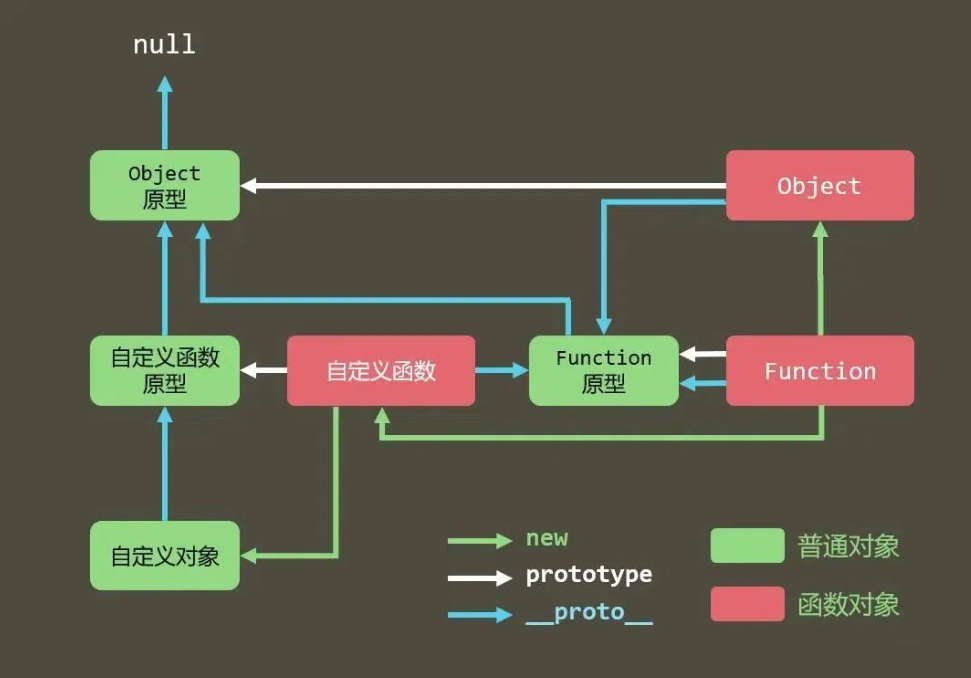

## 003-原型原型链

`原型`
--
`1、构造函数天生自带一个 prototype 属性 是一个对象数据类型`

`2、对象天生自带一个属性 __proto__ 指向所属构造函数的  prototype`

`3、访问对象的成员的时候首先在自己身上查找如果没有自动去到 __proto__ 上查找`

```js
function createObj (name, age) {
    this.name = name
    this.age = age
    this.Hi = function () { console.log('hello world') }
}
var p1 = new createObj ('Jack', 18)
var p2 = new createObj ('Rose', 20)
console.log(p1 == p2)
console.log(p1.Hi == p2.Hi)
```

```js
function Obj () { }
Obj.prototype.Hi = function () { console.log('原型方法') }
console.log(Obj.prototype)
var p1 = new Obj ()
var p2 = new Obj ()
console.log(p1.Hi === p2.Hi)
```

`原型链`



`问题1：` `自定义对象` `身上的 __Proto__ 指向谁?`

- `自定义对象` `身上的 __Proto__ 指向` `自定义函数原型`

`问题2：` `自定义函数原型` `的 __proto__ 指向谁?`

- `自定义函数原型` `是一个对象数据类型 Object`

  `在 Js 内所有的 Object 数据类型都是属于` `内置构造函数 Object`

  `自定义函数原型` `的 __proto__ 指向` `Object 原型`

`问题3：` `自定义函数` `的 __proto__ 指向谁?`

- `自定义函数` `是一个函数 函数本身也是一个对象`

  `在 JS 内所有的函数都是属于` `内置构造函数 Function` `的实例`

  `自定义函数` `的 __proto__ 指向` `Function 原型`

`问题4：` `Object 原型` `的 __proto__ 指向谁?`

- `Object 原型` `是一个对象数据类型 只要是对象都是数据就属于` `内置构造函数 Object `

  `Object 原型` `在 Js 内叫做顶级原型 不在有__proto__了`

  `Object 原型` `的 __proto__ 指向` `null`

`问题5：` `Object` `的 __proto__ 指向谁?`

- `Object` `是一个内置构造函数 同时也是一个函数 同时也是一个对象`

  `在 Js 内 所有的函数都是属于` `内置构造函数 Function` `的实例`

  `Object` `的 __proto__ 指向` `Function 原型`

`问题6：` `Function 原型` `的 __proto__  指向谁？`

- `Function 原型` `也是一个对象数据类型 只要是对象数据类型都属于` `内置构造函数 Object`

  `Function 原型` `的 __proto__  指向` `Object 原型`

`问题7：` `Function` `的 __proto__ 指向谁？`

- `Function` `是一个内置构造函数 也是一个函数`

  `在 JS 内所有的函数都是属于` `内置构造函数 Function` `的实例`

  `Function` `的 __proto__ 指向` `Function 原型`
